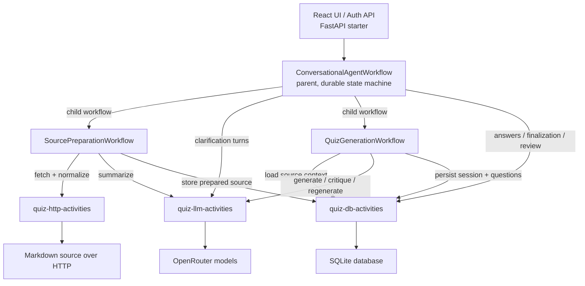
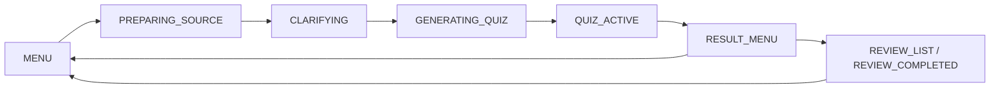

# quiz-agent

## Install

1. Install [uv](https://docs.astral.sh/uv/getting-started/installation/)
2. Install Node.js 20+ and npm
3. Clone the repo and install dependencies:

```bash
git clone <repo-url> && cd quiz-agent
cd backend && uv sync && cd ..
cd frontend && npm install && cd ..
```

# Architecture

The system is split into a durable orchestration layer, specialized workers, and external side-effect boundaries.



## Runtime flow



## Parts

`FastAPI starter`
: Exposes cookie-session auth endpoints, protects the workflow API, and serves the built React UI at `/ui`. It is still a thin transport layer and does not hold quiz state itself.

`ConversationalAgentWorkflow`
: This is the parent Temporal workflow and the main brain of the system. It owns the user-facing state machine, command queue, clarification loop, question loop, deterministic scoring, review screens, and continue-as-new boundaries.

`SourcePreparationWorkflow`
: A bounded child workflow responsible only for source ingestion. It fetches markdown, normalizes it, summarizes it, extracts topic candidates, and persists prepared source context for later quiz generation.

`QuizGenerationWorkflow`
: A bounded child workflow responsible only for quiz production. It loads prepared source context, generates questions, critiques them with a second model, regenerates when needed, validates structure, computes question hashes, and persists the quiz shell.

`quiz-workflows worker`
: Runs the parent workflow plus both child workflows. This worker does orchestration only. It should stay responsive and should not spend time on network, DB, or LLM work directly.

`quiz-http-activities worker`
: Executes HTTP-bound source preparation steps such as fetching markdown and normalizing content for downstream use.

`quiz-llm-activities worker`
: Executes all LLM-backed steps through OpenRouter: summarization, clarification, quiz generation, critique, and regeneration.

`quiz-db-activities worker`
: Executes all persistence and review operations. This includes storing sources, sessions, questions, answers, final scores, abandoned state, and loading completed quiz review data.

`SQLite`
: Stores durable session state outside Temporal's workflow history. That includes quiz sessions, questions, answers, final scores, and prepared source content. DB writes are designed to be idempotent so activity retries stay safe.

`OpenRouter`
: Acts as the single LLM gateway. Different models are configured for clarification, generation, and critique so those responsibilities can evolve independently.

## Why the system is split this way

1. The parent workflow keeps all interactive conversation in one place. That avoids query-driven coordination between workflows and makes replay behavior easier to reason about.
2. Child workflows are bounded and non-interactive. They encapsulate source preparation and quiz generation as reusable orchestration units without owning UI state.
3. Side effects live only in activities. HTTP calls, LLM requests, and DB writes are isolated behind workers so workflow code stays deterministic and replay-safe.
4. Separate task queues prevent slow work from blocking interactive progress. A long LLM call should not degrade command handling or snapshot responsiveness.
5. Persistence is idempotent. If an activity retries after a worker crash, the database remains consistent instead of duplicating sessions or answers.

## Step-by-step execution

1. The client creates a workflow session through the API.
2. The user sends `NEW_QUIZ` with a topic and markdown URL.
3. The parent workflow starts `SourcePreparationWorkflow`.
4. Source preparation fetches the markdown, normalizes it, summarizes it, and persists prepared source context.
5. The parent workflow runs the clarification loop directly, asking the user only when needed.
6. The parent workflow starts `QuizGenerationWorkflow`.
7. Quiz generation loads prepared source context, generates and critiques the quiz, validates it, and persists the session and questions.
8. The parent workflow presents questions one at a time, scores answers deterministically, and persists each answer.
9. After the last answer, the parent workflow computes the weighted final score, finalizes the session, and exposes the result menu.
10. The user can quit, start a new quiz, regenerate the topic with freshness exclusions, or load a completed quiz review.

# Deployment

1. Create a local environment file:

```bash
cp backend/.env.example backend/.env
```

2. Fill in the required values in `backend/.env`:

```bash
OPENROUTER_API_KEY=your-openrouter-api-key
OPENROUTER_CLARIFICATION_MODEL=google/gemini-2.0-flash-001
OPENROUTER_GENERATOR_MODEL=anthropic/claude-3.5-sonnet
OPENROUTER_CRITIC_MODEL=openai/gpt-4.1
DATABASE_URL=quiz_agent.db
QUIZ_DEFAULT_QUESTION_COUNT=6
QUIZ_DEMO_PASSWORD=change-me
QUIZ_SESSION_SECRET=replace-with-a-long-random-secret
QUIZ_SESSION_MAX_AGE_SECONDS=43200
```

`TEMPORAL_ADDRESS`, `TEMPORAL_NAMESPACE`, and `TEMPORAL_API_KEY` are optional for local development. The app defaults to `localhost:7233`.

3. Install and build the React UI:

```bash
cd frontend
npm install
npm run build
cd ..
```

For frontend-only iteration, you can also run:

```bash
cd frontend
npm run dev
```

The Vite dev server proxies `/auth` and `/sessions` to the FastAPI backend.

4. Start Temporal locally if it is not already running:

```bash
temporal server start-dev
```

You can verify it with:

```bash
temporal operator cluster health
```

5. Start the workflow worker in its own terminal:

```bash
cd backend && uv run python -m app.workers.workflow_worker
```

6. Start the HTTP activity worker in a second terminal:

```bash
cd backend && uv run python -m app.workers.http_worker
```

7. Start the LLM activity worker in a third terminal:

```bash
cd backend && uv run python -m app.workers.llm_worker
```

8. Start the DB activity worker in a fourth terminal:

```bash
cd backend && uv run python -m app.workers.db_worker
```

9. Start the FastAPI app in a fifth terminal:

```bash
cd backend && uv run python -m app.starter
```

10. The system is live when all five Python processes above are running and Temporal is healthy. The API will be available at `http://localhost:8000`, interactive API docs will be available at `http://localhost:8000/docs`, and the mounted React UI will be available at `http://localhost:8000/ui`.

No separate database migration command is needed. The SQLite database is created automatically and migrations are applied by the DB layer on first use.

## React UI

The first user layer is a lightweight React app mounted directly inside the FastAPI server at `/ui`.

What it does:

1. Starts with a login screen that uses email plus a shared demo password.
2. Uses the authenticated email as the backend `user_id`.
3. Reuses the existing `/sessions`, `/commands`, and `/snapshot` API behind cookie-session auth.
4. Creates a workflow lazily the first time you start a quiz or open completed reviews.
5. Stores the last email, workflow ID, and local transcript so refresh reconnects to the same workflow.
6. Keeps a chat-style layout with a persistent composer and inline cards for setup, quiz, results, and review flows.

Open `http://localhost:8000/ui` after the starter is running.

## UI Smoke Checklist

1. Open `/ui`.
2. Log in with your email and the shared demo password.
3. Start a new quiz from the setup card by entering a topic and markdown URL.
4. Confirm the UI moves from setup to clarification or directly to quiz generation.
5. Reply to a clarification prompt and confirm the chat transcript updates.
6. Answer a single-answer question using the quiz card.
7. Answer a multi-answer question using the quiz card.
8. Refresh the browser while a quiz is active and confirm the workflow reconnects.
9. Finish the quiz and confirm the result card shows the weighted final score.
10. Open the completed-quiz list and load a stored review.
11. Regenerate the last topic from the result card.
12. Log out and confirm the protected UI returns to the login screen.

# Example run

The example below uses this source URL and the protected API flow:

```json
{
  "markdown_url": "https://github.com/pipecat-ai/pipecat/blob/main/README.md"
}
```

1. Log in and capture the session cookie:

```bash
curl -s -c cookies.txt -b cookies.txt -X POST http://localhost:8000/auth/login \
  -H "Content-Type: application/json" \
  -d '{
    "email": "demo@example.com",
    "password": "change-me"
  }' | python -m json.tool
```

2. Create a workflow session:

```bash
curl -s -c cookies.txt -b cookies.txt -X POST http://localhost:8000/sessions \
  -H "Content-Type: application/json" \
  -d '{}' | python -m json.tool
```

Copy the returned `workflow_id`.

3. Start a new quiz with the Pipecat README:

```bash
curl -s -c cookies.txt -b cookies.txt -X POST http://localhost:8000/sessions/<workflow_id>/commands \
  -H "Content-Type: application/json" \
  -d '{
    "command_id": "cmd-new-quiz-1",
    "kind": "NEW_QUIZ",
    "topic": "Pipecat",
    "markdown_url": "https://github.com/pipecat-ai/pipecat/blob/main/README.md"
  }' | python -m json.tool
```

4. Poll the workflow snapshot:

```bash
curl -s -c cookies.txt -b cookies.txt http://localhost:8000/sessions/<workflow_id>/snapshot | python -m json.tool
```

5. If the snapshot contains `pending_prompt`, reply with a clarification command using `pending_prompt.prompt_id` as the `correlation_id`:

```bash
curl -s -c cookies.txt -b cookies.txt -X POST http://localhost:8000/sessions/<workflow_id>/commands \
  -H "Content-Type: application/json" \
  -d '{
    "command_id": "cmd-clarification-1",
    "kind": "REPLY_CLARIFICATION",
    "correlation_id": "<pending_prompt.prompt_id>",
    "text": "Intermediate difficulty, mixed conceptual and technical questions, focused on pipelines, transports, and real-time voice agents."
  }' | python -m json.tool
```

6. Poll again until `current_question` is present. Then answer the question using `current_question.question_id` as the `correlation_id`:

```bash
curl -s -c cookies.txt -b cookies.txt -X POST http://localhost:8000/sessions/<workflow_id>/commands \
  -H "Content-Type: application/json" \
  -d '{
    "command_id": "cmd-answer-1",
    "kind": "ANSWER_QUESTION",
    "correlation_id": "<current_question.question_id>",
    "selected_answers": [0]
  }' | python -m json.tool
```

For multi-answer questions, send more than one option index, for example `"selected_answers": [0, 2]`.

7. Repeat the snapshot and answer steps until the workflow reaches `RESULT_MENU`.

8. When you are finished, stop the workflow cleanly:

```bash
curl -s -c cookies.txt -b cookies.txt -X POST http://localhost:8000/sessions/<workflow_id>/commands \
  -H "Content-Type: application/json" \
  -d '{
    "command_id": "cmd-quit-1",
    "kind": "QUIT"
  }' | python -m json.tool
```

## Example UI Run

1. Start the backend using the deployment steps above.
2. Open `http://localhost:8000/ui`.
3. Enter:

```text
Email: demo@example.com
Password: change-me
Topic: Pipecat
Markdown URL: https://github.com/pipecat-ai/pipecat/blob/main/README.md
```

4. Click `Enter workspace`.
5. Click `New Quiz`.
6. If clarification appears, reply in the composer.
7. Answer the quiz using the rendered quiz cards.
8. Review the weighted result in the result card.
